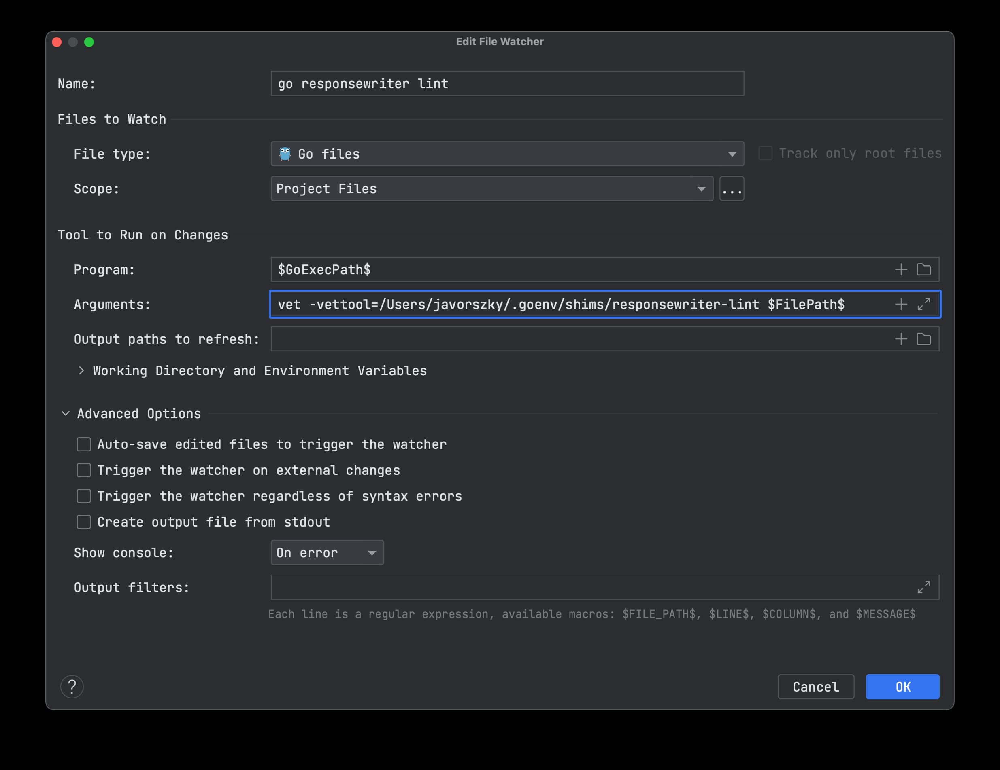

# go-responsewriter-lint

This is a linter you can use on your codebase standalone, as part of `go vet`, or hopefully as part of golangci-lint.

## Why? What does this do?

When working with `http.ResponseWriter`, there's a strict order where you can do things on the interface. Calling `Write` before calling `WriteHeader` will implicitly call `WriteHeader` with a `200 Ok` status, which may or may not be something you want.

Calling `w.Header().Set(...)` after using `w.WriteHeader` will do absolutely nothing, because the response headers have already been sent.

These are easy to forget, and can cause dozens of minutes of lost time trying to figure out why code we're explicitly setting as a 403 Forbidden is actually a 200 Ok.

So I created this linter to bug you if you likely have these issues in your codebase.

(and also to learn about parsing the abstract syntax tree)

## How does it check?

For each function declaration in a file, it checks whether any of the parameters are of an http.ResponseWriter, then check the function body for function calls, and if any of the calls are the `Write`, `Header`, or `WriteHeader`, record their line number, and their token position into a list of results.

At the end of dealing with the function body, look at the list of results, and if the ordering is off in a way that it would cause a likely bug, report on it.

## How do I use it?

### As standalone
1. Clone this repository
2. Run `make install`
3. Check that you have `responsewriter-lint` in your path: `which responsewriter-lint` should give you a path. If not, you probably need to put your Go bin path in your `PATH` variable
4. Go into the folder of the codebase you want to check
5. `$ responsewriter-lint ./...`

### As part of `go vet`
1. Clone this repository
2. Run `make install`
3. Check that you have `responsewriter-lint` in your path: `which responsewriter-lint` should give you a path. If not, you probably need to put your Go bin path in your `PATH` variable
4. Go into the folder of the codebase you want to check
5. `$ go vet -vettool=$(which responsewriter-lint) ./...`

## How do I use it in the IDE?

Your IDE is probably going to be different. I'm using Jetbrains's Goland in how I set it up.

Once you installed it with `make install`, grab the path of the command with `which responsewriter-lint`. You're going to need it, because I haven't figured out how to get the `$(which responsewriter-lint)` working inside the file watcher command.

Anyways.

Here's the settings:

* Command needs to be `$GoExecPath$`
* Arguments need to be `vet -vettool=<full path to the command> $FilePath$`

Once you have this, and turned off the auto-save and trigger on external changes tickboxes, you will be presented with a running list of issues in your IDE's built in Output window.

